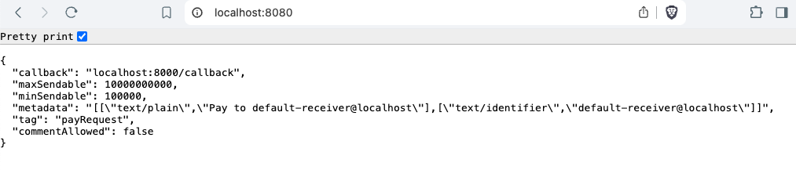
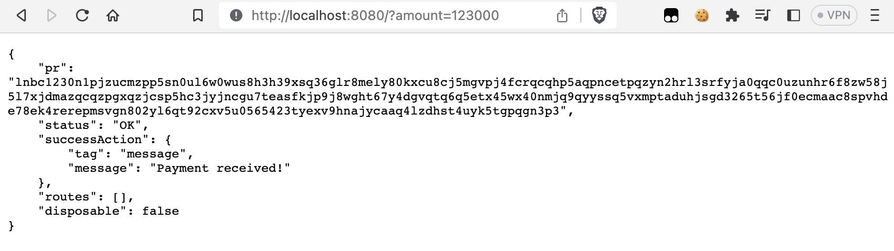

#  Demo lightning-address


Use the `lnaddress` to be able to *get a callback url* and *request an invoice from your server*.

This demo shows that the entire library works by using the library code + with custom configuration in your own `lightning-config.php`.

## Setup

#### From scratch

```bash
composer init
composer require php-lightning/lnaddress
```

#### Using this template

```bash
https://github.com/php-lightning/demo-lnaddress/generate
composer install
```

## Configuration

The configuration is set up in `lightning-config.php` and `nostr.json` at the root of the project.
```bash
cp lightning-config.dist.php lightning-config.php
```
```bash
cp nostr.dist.json nostr.json
```

## What can you do?

Start your server:

```bash
php -S localhost:8080 vendor/php-lightning/lnaddress/public/index.php
```

1) Get a callback url and lightning server configuration. Request without any GET params:
```http request
http://localhost:8080/  
```


2) Request an invoice from your server (in milli-sats). Request using amount as GET param:
```http request
http://localhost:8080/user_1?amount=100000  
```

