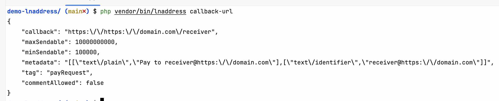
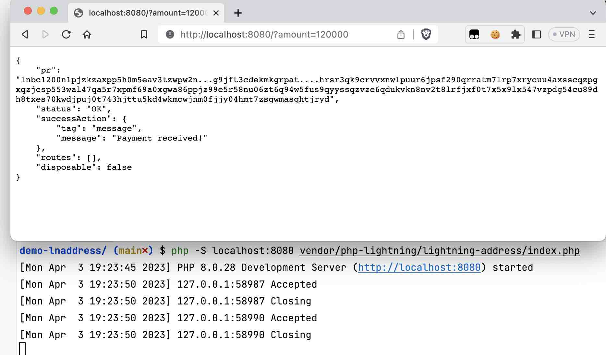
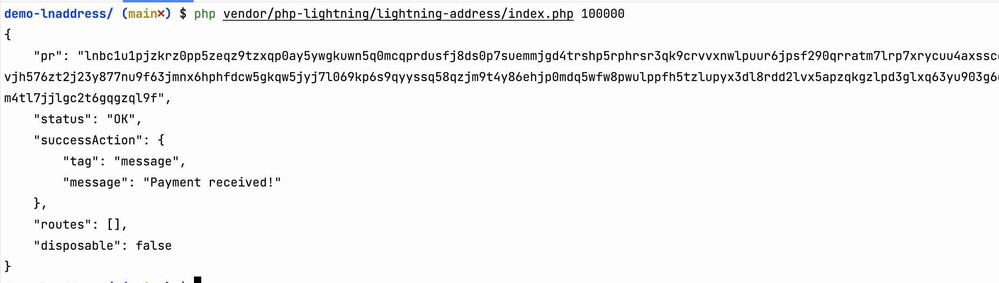

#  Demo lightning-address


Use the `lnaddress` to be able to *get a callback url* and *request an invoice from your server*.

This demo shows that the entire library works by using the library code + with custom configuration in your own `lightning-config.php`.

## Setup

#### From scratch

```bash
composer init
composer require php-lightning/lnaddress
```

#### Using this template

```bash
https://github.com/php-lightning/demo-lnaddress/generate
composer install
```

## Configuration

The configuration is set up in `lightning-config.php` at the root of the project.

```php
<?php
return (new LightningConfig())
    ->setDomain('your-domain.com')
    ->setReceiver('custom-receiver')
    ->setSendableRange(min: 100_000, max: 10_000_000_000)
    ->addBackend(
        (new LnBitsBackendConfig())
            ->setApiEndpoint('http://localhost:5000') // lnbits endpoint : protocol://host:port
            ->setApiKey('3h9e75cf...9eca373'),        // put your lnbits read key here
    );
```

## What can you do?

#### Get a callback url

```bash
vendor/bin/lnaddress callback-url
```


#### Request an invoice from your server (in millisats)

This is the FE part which could be listening in your own server

```bash
php -S localhost:8080 vendor/php-lightning/lnaddress/public/index.php

# And then request using amount as GET param:
http://localhost:8080/?amount=100000  
```


Or as command:
```php
php vendor/php-lightning/lnaddress/public/index.php 100000
```
